<div align="center">


<br/>

### 👋 Welcome to my GitHub

**AI · Machine Learning · Deep Learning · NLP · Computer Vision**

모델을 직접 구현하고 분석하며,  
**AI 모델의 성능 개선과 실제 서비스 적용**에 관심을 가지고 있습니다.

<br/>

</div>

---

## 👩‍💻 About Me

- 🎓 **Computer Science / AI**
- 🤖 Machine Learning · Deep Learning 기반 AI 모델 연구 및 개발
- 🧠 Transformer · LLM · NLP 모델 구조 및 학습 방법 연구
- 👁️ Computer Vision 기반 의료·이미지 AI 모델 개발
- 🔬 모델 구조 분석, 실험 설계, 성능 비교 및 개선에 관심
- 🚀 연구에서 끝나지 않고 **실제 서비스에 적용 가능한 AI** 개발을 목표

<br/>

## 🔎 Research & Interests

```text
Artificial Intelligence
├── Machine Learning
├── Deep Learning
├── Natural Language Processing
│   ├── Transformer
│   ├── LLM
│   ├── PEFT
│   └── Neural Machine Translation
│
├── Computer Vision
│   ├── Medical AI
│   ├── Image Classification
│   ├── Attention / ROI
│   └── Generative AI
│
└── AI Systems
    ├── Model Optimization
    ├── GPU Computing
    └── AI Service Deployment
```

<br/>

## 🛠 Tech Stack

### 💻 Languages

<p>
  
  
  
  
</p>

### 🤖 AI / Deep Learning

<p>
  
  
  
  
  
  
</p>

### 👁️ Computer Vision / Data

<p>
  
  
  
</p>

### ☁️ Development / Infra

<p>
  
  
  
  
  
  
  
</p>

<br/>

---

## 🚀 Featured Work

### 🧠 Transformer Attention Analysis & Mid-LN

**Transformer Attention 구조 분석 및 새로운 Layer Normalization 구조 연구**

- Encoder / Decoder Attention 분석
- Attention Entropy 및 Heatmap 기반 Layer · Head 특성 분석
- Pre-LN Transformer 기반 **Mid-LN 구조 설계**
- 한국어 ↔ 영어 Neural Machine Translation 실험
- BLEU 기반 모델 성능 비교 및 구조 개선

`Transformer` `NLP` `NMT` `Attention` `PyTorch`

<br/>

### 🩻 Pediatric Bone Age Prediction

**수부 X-ray 기반 Bone Age AI 모델 개발**

- Pediatric Hand X-ray 기반 Bone Age Regression
- Attention 기반 ROI 및 전처리 방법 연구
- InceptionV3 · ConvNeXt 등 CNN Architecture 실험
- 모델 경량화 및 성능 개선
- 실제 기업 검증 환경을 고려한 AI 모델 개발

`Computer Vision` `Medical AI` `CNN` `Attention` `PyTorch`

<br/>

### 👕 Generative AI Virtual Fitting

**생성형 AI 기반 가상 피팅 서비스 개발**

- 사용자 이미지와 의류 이미지를 활용한 Virtual Try-On
- 생성형 AI 모델 및 이미지 전처리 Pipeline 적용
- 인물 특징 및 의류 디테일 유지 방법 실험
- B2B 쇼핑몰 연동 및 B2C 서비스 구조 설계
- AI 모델 선택 및 서비스 적용을 위한 모델 비교

`Generative AI` `Computer Vision` `Virtual Try-On` `AI Service`

<br/>

### 📊 LLM-based Financial Disclosure Analysis

**LLM을 활용한 MD&A 공시품질 정량화 및 주가 변동성 분석**

- LLM 기반 기업 공시 텍스트 분석
- MD&A 공시품질 정량화
- 금융 데이터와 주가 변동성 간 관계 분석
- 데이터 기반 실증 분석 수행

`LLM` `NLP` `Data Analysis` `Finance`

<br/>

---

## 📊 GitHub Stats

<div align="center">


&nbsp;&nbsp;


</div>

<br/>

> GitHub Stats are automatically updated by **GitHub Actions**.

<br/>

---

## 🎯 Currently Focusing On

<div align="center">

| Area | Focus |
|:---:|:---|
| 🧠 **AI Research** | Transformer · Attention · Model Architecture |
| 💬 **LLM / NLP** | LLM · PEFT · Neural Machine Translation |
| 👁️ **Computer Vision** | Medical AI · Generative AI · Image Analysis |
| ⚡ **Optimization** | Lightweight AI · Model Performance |
| 🚀 **AI Service** | Model Deployment · AI System Integration |

</div>

<br/>

---

## 📫 Contact

<div align="center">

<a href="https://github.com/KNY03">
  
</a>

</div>

<br/>

---

<div align="center">

### 🚀 Building AI through Research, Experimentation, and Implementation

**Machine Learning · Deep Learning · NLP · Computer Vision**

<br/>


</div>
